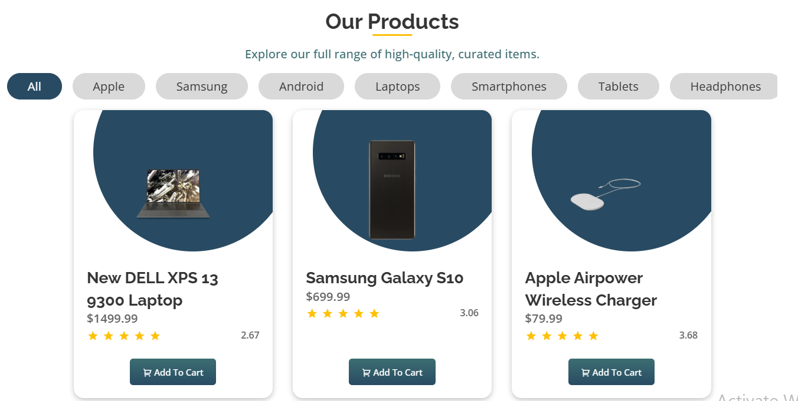
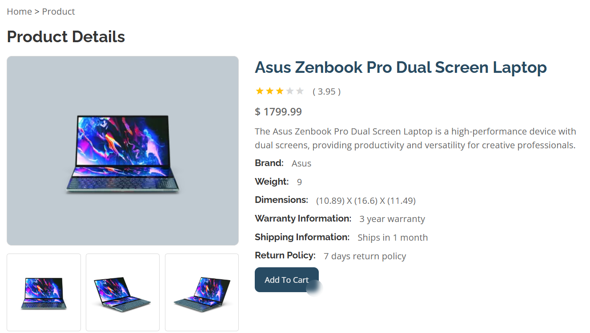
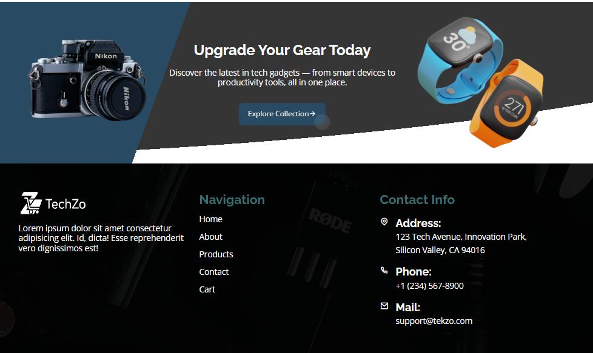
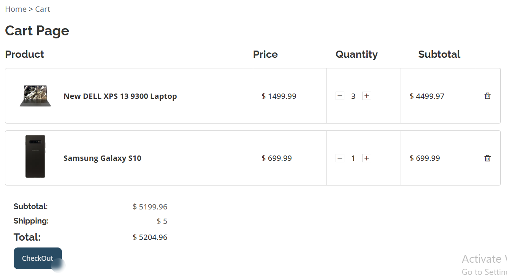
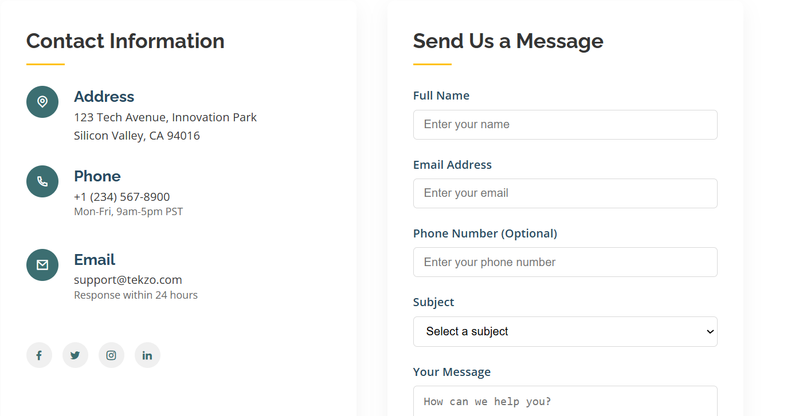

# 🚀 Techzo – E-commerce Product Page


> 🛠️ Internship Project | Frontend Developer | Tech Gadget E-commerce Platform

---

## 📚 Overview

**Techzo** is a responsive, modular, and fully interactive e-commerce website built using vanilla HTML, CSS, and JavaScript. The project simulates a real-world product shopping experience inspired by platforms like **Amazon** and **Flipkart**, and includes dynamic product interaction, cart management with persistence, and API integration.

---

## ✨ Features

- ✅ **Responsive Layout** (Mobile + Tablet + Desktop)
- 🖼️ **Image Zoom on Hover**
- 🔢 **Quantity Selector with Real-time Total Price**
- 🛒 **Add to Cart + Persistent Cart Using LocalStorage**
- 📦 **Cart Page** (View, Edit, Remove Items)
- 🔗 **Integrated with DummyJSON API**
- 📄 **About** and **Contact Us** Pages

---

## 📁 Folder Structure

```bash
ecommerce-product-page/
├── index.html          # Home page
├── product.html        # Products page
├── productDetail.html  # Product detail page
├── cart.html           # Shopping cart page
├── about.html          # About Techzo
├── contact.html        # Contact us page
├── css/
│   └── style.css       # All styling rules
├── js/
│   ├── main.js    
│   ├── product.js      # Product logic 
│   ├── cart.js         # Cart logic (display, update, remove)
│   └── utils.js        # Utility functions (e.g. localStorage)
├── assets/
│   └── images/         # Product & UI images
````

---

## 🔢 Price Formula

> 🧮 **Total Price = Product Price × Quantity**

Example:
If price = `$25` and quantity = `3`,
then **Total = 25 × 3 = \$75**

---

## 🧪 Technologies Used

| Tech            | Description                               |
| --------------- | ----------------------------------------- |
| `HTML5`         | Markup structure for the pages            |
| `CSS3`          | Styling and responsiveness                |
| `JavaScript`    | Core logic for interactivity and cart ops |
| `localStorage`  | To persist cart data between pages        |
| `DummyJSON API` | To simulate fetching real products        |

---

## 🔗 DummyJSON API

Example product fetch:

```js
fetch("https://dummyjson.com/products/1")
  .then(res => res.json())
  .then(data => console.log(data));
```

---

## 🧭 Pages Included

| Page           | Description                                      |
| -------------- | ------------------------------------------------ |
| `index.html`   | Home page with sample product previews           |
| `product.html` | Dynamic product detail page with zoom + variants |
| `cart.html`    | Shopping cart preview page                       |
| `about.html`   | Info about the company                           |
| `contact.html` | Contact form / information                       |

---

<details>
  <summary>📸 Screenshots (Click to expand)</summary>

### 🏠 Home Page


### 📄 Product Page



### 🔍 Cta and Footer


### 🛒 Cart Page


### ☎️ Contact Page



</details>


---

## 🧠 What I Learned

* DOM manipulation for UI updates
* Working with `localStorage` for data persistence
* Responsive design principles
* Creating modular JavaScript with reusable functions
* Integrating external APIs into a frontend project

---

## 🧑‍💻 Author

**Walija**
Web Developer Intern
🌐 [GitHub](https://github.com/Walija-sh) • 📧 [Email](mailto:walijash@example.com)

---

## 🗂️ How to Use

1. 📥 Clone or download this repo
2. 🌐 Open `index.html` in a browser
3. 🛍️ Browse products and open `product.html`
4. 🛒 Add products to cart and open `cart.html`
5. 🔁 Refresh or revisit — cart stays thanks to `localStorage`!

---

> *Thank you for checking out Techzo — a modern, lightweight e-commerce prototype built for performance and simplicity!*

---

